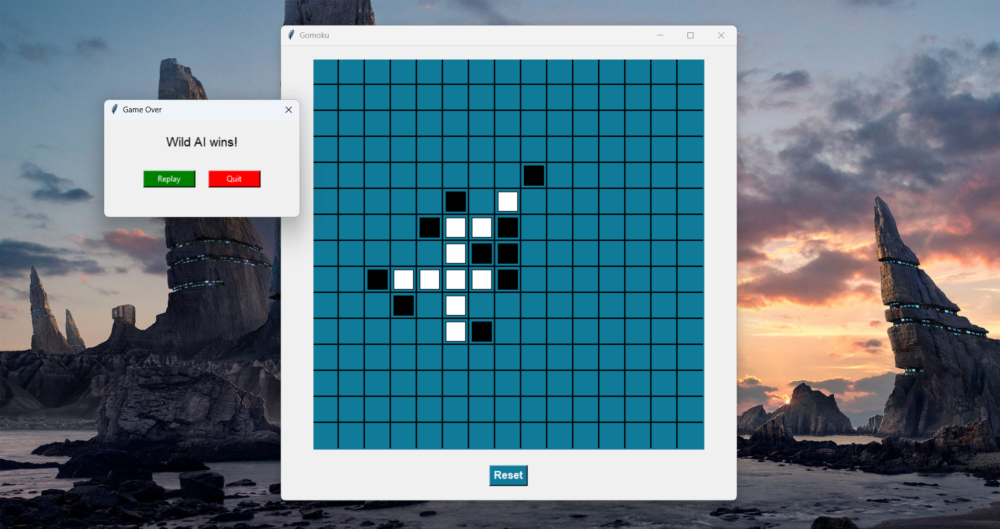

# 🧠🎯 GOMOKU: AI-Infused Board Battle 🎯🧠

🕹️ _"Can your brain beat the machine?"_ <br>
Welcome to **Gomoku** — a thrilling 15x15 board game where you align 5 stones in a row to conquer! Play against your friend or challenge our sneaky AI overlords powered by **Alpha-Beta Pruning** and **Minimax**!

## 🚀 Features

✅ GUI-based interface using `tkinter`  
🤖 AI vs AI mode (sit back and watch!)  
🧍 Player vs Player mode  
👤 Player vs AI with smart strategy  
🧠 Uses Alpha-Beta Pruning & Minimax algorithms  
🎯 Detects winning, blocking, and draws  

## 🎮 Game Modes

1. **Player vs Player**  
2. **Player vs AI**  
3. **AI vs AI**

## 🛠️ How to Play

Make sure you've got Python 3.x installed. Then run:

```bash
python main.py
```

You'll be greeted with a beautiful GUI to:

- Enter player names
- Choose AI or Human for each player
- Pick who starts first
- Let the game begin!

## 🧬 AI Logic

The game uses two smart AI strategies:

- **Alpha-Beta Pruning** for faster decision-making  
- **Minimax** for strategic brute force  

Each AI looks ahead a few steps (`depth`) to:

- Try to win 😎
- Block opponents 😈
- Choose the most promising moves


## 🧾 File Structure

```text
├── main.py                      # 🔥 Launch the game here!
├── Board.py                     # 📋 Board logic (win/draw checks)
├── Players.py                   # 🧍 Human and AI player classes
├── gameEngine.py                # ⚙️ Game engine (game loop, player turns)
├── startGame.py                 # 🎮 Game start logic
├── algorithms/
│   ├── alphaBetaPruning.py      # 🤖 Alpha-Beta pruning implementation
│   ├── minimax.py               # 🧠 Classic Minimax algorithm
│   └── common.py                # 🔗 Common utility functions
├── assets/
│   ├── board.png                # 🖼️ Board image
└── README.md                    # 📖 You're here!
```

## 💻 Screenshots


You’ll see a grid-based board, click to place stones, and let the AI make its move!


## 💡 Strategy Tip

> Always block before you attack. 🛡️  
> The center is powerful. 🌌  
> Don’t trust the AI — it's smarter than it looks! 🤖


## 🙌 Credits

Made with ❤️ using Python and `tkinter`.  
Star if you like it ⭐

## 📬 Contributions

Feel free to fork, play around, and PR your ideas!  

## 🏁 Ready to Play?

Just hit:

```bash
python main.py
```

And dive into the **Gomoku battle zone**! 💥

🖤 Good luck, champion. May your stones align forever. 🖤

